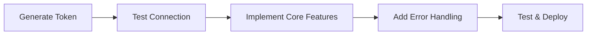

# Getting Started

Welcome to the EPMware REST API! This guide will help you get up and running quickly with the API.

## Overview

The EPMware REST API provides a comprehensive set of endpoints for integrating with and automating EPMware operations. Whether you're building custom integrations, automating workflows, or creating monitoring dashboards, this guide will help you understand the fundamentals.

## Prerequisites

Before you begin, ensure you have:

- ✅ **EPMware Access**: Valid user account with appropriate permissions
- ✅ **API Token**: Generated through the EPMware Security Module
- ✅ **EPMware URL**: Your instance URL (e.g., `https://demo.epmwarecloud.com`)
- ✅ **HTTP Client**: Tool for making API calls (cURL, Postman, or programming language)

## Quick Start Steps

### Step 1: Generate Your API Token

Navigate to the EPMware Security Module and generate an API token for your user account.

[📖 Authentication Guide →](authentication/)

### Step 2: Understand the URL Structure

Learn how EPMware API URLs are constructed:

```
https://<EPMWARE_URL>/service/api/<module>/<action>
```

[📖 URL Structure Guide →](url-structure/)

### Step 3: Make Your First API Call

Test your setup with a simple status check:

```bash
curl -X GET 'https://demo.epmwarecloud.com/service/api/task/get_status/244591' \
  -H 'Authorization: Token YOUR_TOKEN_HERE'
```

### Step 4: Handle Responses

Understand the standard response format:

```json
{
  "status": "S",
  "message": "Task completed successfully",
  "data": { ... }
}
```

[📖 Response Formats Guide →](response-formats/)

### Step 5: Implement Error Handling

Learn to handle errors gracefully:

```json
{
  "status": "E",
  "message": "Authentication required",
  "errorCode": "AUTH_001"
}
```

[📖 Error Handling Guide →](error-handling/)

## Core Concepts

### Authentication
All API requests require token-based authentication. Tokens are passed in the `Authorization` header of each request.

### Modules
The API is organized into functional modules:
- **Task**: Task monitoring and management
- **ERP**: ERP integration operations
- **Deployment**: Deployment automation
- **Export**: Data export operations
- **Security**: User and group management

### Synchronous vs Asynchronous
- **Synchronous**: Immediate response (e.g., get user details)
- **Asynchronous**: Returns task ID for tracking (e.g., run import)

### Rate Limiting
The API implements rate limiting to ensure fair usage:
- Standard limit: 100 requests per minute
- Bulk operations: 10 requests per minute

## Development Workflow



## Environment Setup

### Development Environment

```bash
# Set environment variables
export EPMWARE_URL="https://dev.epmwarecloud.com"
export EPMWARE_TOKEN="your-dev-token-here"
```

### Production Environment

```bash
# Use secure token storage
export EPMWARE_URL="https://prod.epmwarecloud.com"
export EPMWARE_TOKEN="${SECURE_TOKEN_VAULT}"
```

## Common Integration Patterns

### Pattern 1: Scheduled Data Import

```python
# Run daily at 2 AM
schedule.every().day.at("02:00").do(run_erp_import)
```

### Pattern 2: Event-Driven Export

```python
# Trigger export when data changes
on_data_change(trigger_export)
```

### Pattern 3: User Synchronization

```python
# Sync users from HR system
sync_users_from_hr()
```

## Best Practices Summary

1. **Security First**: Always use HTTPS and secure token storage
2. **Error Handling**: Implement comprehensive error handling
3. **Rate Limiting**: Respect API rate limits
4. **Logging**: Log all API interactions for debugging
5. **Testing**: Test in development before production

## Tools and Resources

### Recommended Tools

| Tool | Purpose | Link |
|------|---------|------|
| **Postman** | API testing and exploration | [Download](https://www.postman.com) |
| **cURL** | Command-line HTTP client | Built into most systems |
| **Python Requests** | Python HTTP library | `pip install requests` |
| **PowerShell** | Windows automation | Built into Windows |

### Sample Code Repository

Find complete examples in our [GitHub repository](https://github.com/epmware/api-examples).

## Next Steps

Ready to dive deeper? Explore these resources:

<div class="next-steps-grid">

📚 **[API Modules](../modules/)** - Detailed module documentation

🔧 **[API Reference](../reference/)** - Complete endpoint reference

💡 **[Examples](../examples/)** - Practical implementation examples

⚡ **[Best Practices](../best-practices/)** - Advanced tips and patterns

</div>

## Getting Help

If you need assistance:

- 📧 Contact support: [support@epmware.com](mailto:support@epmware.com)
- 📖 Review [Troubleshooting Guide](../appendices/troubleshooting/)
- 💬 Join our developer community

---

Ready to start building? [Explore the API Modules →](../modules/)
