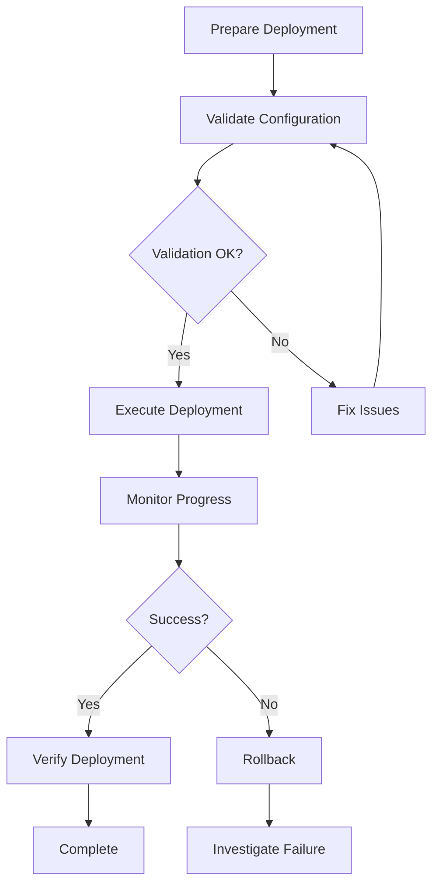

# Deployment Module

Automate and manage EPMware deployments across environments through the REST API.

## Overview

The Deployment module provides APIs for executing and monitoring deployment tasks in EPMware. It enables automated deployment of configurations, metadata, and applications across different environments (Development, Test, Production) with full tracking and rollback capabilities.

## Key Features

- **Automated Deployments**: Execute deployments programmatically
- **Environment Management**: Deploy across multiple environments
- **Version Control**: Track deployment versions and history
- **Rollback Support**: Revert to previous versions if needed
- **Execution Monitoring**: Real-time deployment status tracking
- **Audit Trail**: Complete deployment history and logs

## Available Endpoints

| Endpoint | Method | Description |
|----------|--------|-------------|
| [`/service/api/deployment/run`](run-deployment/) | POST | Execute deployment task |
| [`/service/api/deployment/get_execution_details`](get-execution-details/) | GET | Get deployment execution history |

## Deployment Workflow



## Deployment Types

### 1. Application Deployment
Deploy EPMware applications and configurations:
- Forms and Reports
- Business Rules
- Calculation Scripts
- Data Forms
- Dashboards

### 2. Metadata Deployment
Deploy structural components:
- Dimensions
- Hierarchies
- Member Properties
- Attributes
- UDAs (User Defined Attributes)

### 3. Security Deployment
Deploy security configurations:
- User Provisioning
- Group Assignments
- Access Permissions
- Role Definitions
- Security Filters

### 4. Data Deployment
Deploy data between environments:
- Master Data
- Transaction Data
- Planning Data
- Historical Data
- Reference Data

## Environment Management

### Environment Types

| Environment | Purpose | Deployment Frequency | Approval Required |
|-------------|---------|---------------------|-------------------|
| **Development** | Build and test | Multiple daily | No |
| **Test** | QA and UAT | Daily | No |
| **Staging** | Pre-production | Weekly | Yes |
| **Production** | Live system | Scheduled | Yes |

### Environment Configuration

```json
{
  "environments": {
    "dev": {
      "url": "https://dev.epmwarecloud.com",
      "autoApprove": true,
      "maintenanceWindow": "anytime"
    },
    "test": {
      "url": "https://test.epmwarecloud.com",
      "autoApprove": true,
      "maintenanceWindow": "anytime"
    },
    "prod": {
      "url": "https://prod.epmwarecloud.com",
      "autoApprove": false,
      "maintenanceWindow": "Saturday 10PM-2AM",
      "approvers": ["admin@company.com"]
    }
  }
}
```

## Common Use Cases

### CI/CD Pipeline Integration

```python
import requests
from datetime import datetime

class DeploymentPipeline:
    def __init__(self, api_config):
        self.api_config = api_config
        
    def deploy_to_environment(self, env, package):
        """Deploy package to specified environment"""
        
        # Pre-deployment validation
        if not self.validate_package(package):
            raise ValueError("Package validation failed")
        
        # Check maintenance window
        if not self.in_maintenance_window(env):
            raise RuntimeError(f"Outside maintenance window for {env}")
        
        # Execute deployment
        response = self.run_deployment(env, package)
        task_id = response['taskId']
        
        # Monitor deployment
        status = self.monitor_deployment(task_id)
        
        # Post-deployment validation
        if status == 'SUCCESS':
            self.validate_deployment(env, package)
        else:
            self.rollback_deployment(env, package)
        
        return status
    
    def run_deployment(self, env, package):
        """Execute deployment via API"""
        url = f"{self.api_config[env]['url']}/service/api/deployment/run"
        headers = {
            "Authorization": f"Token {self.api_config[env]['token']}"
        }
        
        payload = {
            "deploymentName": package['name'],
            "version": package['version'],
            "components": package['components']
        }
        
        response = requests.post(url, json=payload, headers=headers)
        return response.json()
```

### Scheduled Deployments

```python
import schedule
import time

def schedule_deployments():
    """Schedule regular deployments"""
    
    # Daily test environment refresh
    schedule.every().day.at("06:00").do(
        deploy_to_test,
        package="daily_refresh"
    )
    
    # Weekly production deployment
    schedule.every().saturday.at("22:00").do(
        deploy_to_production,
        package="weekly_release"
    )
    
    # Monthly full deployment
    schedule.every().month.do(
        full_deployment,
        environments=["test", "staging", "prod"]
    )
    
    while True:
        schedule.run_pending()
        time.sleep(60)
```

### Blue-Green Deployment

```python
def blue_green_deployment(package):
    """Implement blue-green deployment strategy"""
    
    # Deploy to inactive environment (green)
    green_status = deploy_to_environment('green', package)
    
    if green_status == 'SUCCESS':
        # Run smoke tests
        if run_smoke_tests('green'):
            # Switch traffic to green
            switch_traffic('green')
            
            # Mark blue as inactive
            mark_inactive('blue')
            
            return 'SUCCESS'
        else:
            # Tests failed, stay on blue
            cleanup_environment('green')
            return 'TEST_FAILED'
    else:
        return 'DEPLOYMENT_FAILED'
```

## Deployment Packages

### Package Structure

```yaml
# deployment-package.yaml
name: Q1_2025_Release
version: 1.0.0
description: Q1 2025 feature release
created: 2025-01-15T10:00:00Z
author: deployment@company.com

components:
  - type: metadata
    items:
      - dimensions/Product.xml
      - dimensions/Entity.xml
      - hierarchies/ProductHierarchy.xml
  
  - type: rules
    items:
      - rules/Consolidation.rule
      - rules/Currency.rule
      - rules/Allocation.rule
  
  - type: forms
    items:
      - forms/DataEntry.form
      - forms/Reporting.form
  
  - type: security
    items:
      - security/users.xml
      - security/groups.xml
      - security/permissions.xml

validation:
  pre_deployment:
    - check: dimension_exists
      dimension: Product
    - check: no_calc_running
  
  post_deployment:
    - check: form_accessible
      form: DataEntry
    - check: rule_valid
      rule: Consolidation

rollback:
  enabled: true
  snapshot: auto
```

### Creating Deployment Packages

```python
import os
import zipfile
import json

def create_deployment_package(components, metadata):
    """Create a deployment package"""
    
    package_name = f"{metadata['name']}_{metadata['version']}.zip"
    
    with zipfile.ZipFile(package_name, 'w') as package:
        # Add metadata
        package.writestr('metadata.json', json.dumps(metadata))
        
        # Add components
        for component in components:
            if os.path.exists(component):
                package.write(component)
        
        # Add validation scripts
        package.write('validation/pre_deploy.py')
        package.write('validation/post_deploy.py')
    
    return package_name
```

## Monitoring and Rollback

### Deployment Monitoring

```python
def monitor_deployment_with_alerts(task_id, timeout=3600):
    """Monitor deployment with alerting"""
    
    start_time = time.time()
    last_status = None
    
    while time.time() - start_time < timeout:
        status = get_deployment_status(task_id)
        
        if status != last_status:
            # Status changed, send update
            send_notification(f"Deployment {task_id}: {status}")
            last_status = status
        
        if status in ['SUCCESS', 'FAILED', 'ROLLED_BACK']:
            # Deployment complete
            generate_deployment_report(task_id)
            return status
        
        # Check for issues
        if status == 'WARNING':
            investigate_warnings(task_id)
        
        time.sleep(30)
    
    # Timeout reached
    cancel_deployment(task_id)
    return 'TIMEOUT'
```

### Rollback Strategy

```python
def intelligent_rollback(deployment_id):
    """Implement intelligent rollback strategy"""
    
    deployment = get_deployment_details(deployment_id)
    
    # Determine rollback strategy
    if deployment['type'] == 'metadata':
        # Restore from snapshot
        restore_metadata_snapshot(deployment['snapshot_id'])
        
    elif deployment['type'] == 'data':
        # Reverse data changes
        reverse_data_changes(deployment['change_log'])
        
    elif deployment['type'] == 'security':
        # Restore security settings
        restore_security_backup(deployment['backup_id'])
    
    # Verify rollback
    if verify_rollback(deployment_id):
        notify_team(f"Rollback successful for {deployment_id}")
        return 'SUCCESS'
    else:
        escalate_to_admin(f"Rollback failed for {deployment_id}")
        return 'FAILED'
```

## Best Practices

### 1. Pre-Deployment Validation

```python
def validate_before_deployment(package, environment):
    """Comprehensive pre-deployment validation"""
    
    validations = []
    
    # Check environment readiness
    validations.append(check_environment_status(environment))
    
    # Validate package integrity
    validations.append(verify_package_checksum(package))
    
    # Check dependencies
    validations.append(verify_dependencies(package, environment))
    
    # Verify permissions
    validations.append(check_deployment_permissions(environment))
    
    # Check for conflicts
    validations.append(detect_conflicts(package, environment))
    
    return all(validations)
```

### 2. Deployment Windows

```python
from datetime import datetime, time

def is_valid_deployment_window(environment):
    """Check if current time is within deployment window"""
    
    windows = {
        'prod': [(time(22, 0), time(2, 0))],  # 10 PM to 2 AM
        'test': [(time(0, 0), time(23, 59))],  # Anytime
        'dev': [(time(0, 0), time(23, 59))]    # Anytime
    }
    
    current_time = datetime.now().time()
    
    for start, end in windows.get(environment, []):
        if start <= current_time <= end:
            return True
    
    return False
```

### 3. Change Management

```python
def create_change_request(deployment):
    """Create change management request"""
    
    change_request = {
        'id': generate_change_id(),
        'deployment': deployment['name'],
        'environment': deployment['environment'],
        'scheduled_time': deployment['scheduled_time'],
        'components': deployment['components'],
        'impact_analysis': analyze_impact(deployment),
        'rollback_plan': deployment['rollback_plan'],
        'approvals': []
    }
    
    # Get required approvals
    approvers = get_approvers(deployment['environment'])
    
    for approver in approvers:
        approval = request_approval(approver, change_request)
        change_request['approvals'].append(approval)
    
    return change_request
```

## Performance Optimization

### Parallel Deployments

```python
from concurrent.futures import ThreadPoolExecutor

def deploy_components_parallel(components, environment):
    """Deploy independent components in parallel"""
    
    with ThreadPoolExecutor(max_workers=5) as executor:
        futures = []
        
        for component in components:
            if not has_dependencies(component):
                future = executor.submit(
                    deploy_component,
                    component,
                    environment
                )
                futures.append(future)
        
        # Wait for all deployments
        results = [f.result() for f in futures]
    
    return results
```

### Incremental Deployments

```python
def incremental_deployment(package, environment):
    """Deploy only changed components"""
    
    # Get current state
    current_state = get_environment_state(environment)
    
    # Identify changes
    changes = identify_changes(package, current_state)
    
    if not changes:
        return "No changes to deploy"
    
    # Deploy only changes
    for change in changes:
        deploy_change(change, environment)
    
    return f"Deployed {len(changes)} changes"
```

## Troubleshooting

### Common Issues

| Issue | Symptoms | Resolution |
|-------|----------|------------|
| Deployment timeout | Task stuck in RUNNING | Check system resources, increase timeout |
| Permission denied | Deployment fails immediately | Verify API token permissions |
| Version conflict | Deployment rejected | Check component versions |
| Dependency missing | Deployment fails midway | Verify all dependencies exist |
| Rollback failure | Cannot revert changes | Manual intervention required |

### Debug Checklist

1. ✅ Verify deployment package integrity
2. ✅ Check target environment status
3. ✅ Confirm maintenance window
4. ✅ Validate permissions and approvals
5. ✅ Review dependency requirements
6. ✅ Check system resource availability
7. ✅ Verify network connectivity

## Related Documentation

- [Run Deployment](run-deployment/) - Deployment execution details
- [Get Execution Details](get-execution-details/) - Deployment history
- [Task Module](../task/) - Monitor deployment tasks
- [Examples](../../examples/deployment-automation/) - Implementation examples
- [Best Practices](../../best-practices/) - Deployment guidelines

---

[← Back to Modules](../) | [Run Deployment →](run-deployment/)
