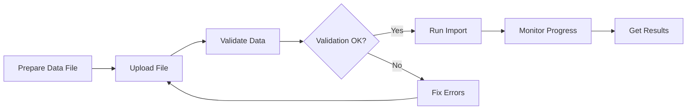

# ERP Module

Integrate EPMware with Enterprise Resource Planning systems through file uploads and import operations.

## Overview

The ERP module enables seamless integration between EPMware and various ERP systems by providing APIs for uploading data files and executing import processes. This module supports batch processing, data validation, and automated workflows for financial and operational data.

## Key Features

- **File Upload**: Upload CSV, Excel, and other formatted files
- **Data Validation**: Automatic validation against predefined rules
- **Import Execution**: Process uploaded files into EPMware
- **Error Handling**: Detailed error reporting and recovery
- **Batch Processing**: Handle large volumes of data efficiently

## Available Endpoints

| Endpoint | Method | Description |
|----------|--------|-------------|
| [`/service/api/erp/upload_file`](upload-file/) | POST | Upload data file for import |
| [`/service/api/erp/run`](run-import/) | POST | Execute ERP import process |

## Workflow Overview



## Supported File Formats

| Format | Extension | Description | Max Size |
|--------|-----------|-------------|----------|
| **CSV** | .csv | Comma-separated values | 100 MB |
| **Excel** | .xlsx, .xls | Microsoft Excel files | 50 MB |
| **TSV** | .tsv | Tab-separated values | 100 MB |
| **Fixed Width** | .txt | Fixed-width text files | 100 MB |
| **XML** | .xml | Structured XML data | 50 MB |

## Data Import Types

### 1. Master Data Import

Import reference data such as:
- Chart of Accounts
- Cost Centers
- Entities
- Currencies
- Exchange Rates

### 2. Transaction Data Import

Import transactional data including:
- Journal Entries
- Trial Balances
- Budget Data
- Forecast Data
- Actuals

### 3. Metadata Import

Import system configuration:
- Hierarchies
- Mappings
- Business Rules
- Security Assignments

## Common Use Cases

### Financial Close Automation

```python
import requests
import time

def automate_monthly_close(period, files):
    """Automate monthly financial close process"""
    
    for file_path in files:
        # Upload trial balance
        with open(file_path, 'rb') as f:
            response = upload_file(f, 'TRIAL_BALANCE')
            upload_task_id = response['taskId']
        
        # Wait for upload completion
        wait_for_task(upload_task_id)
        
        # Run import
        import_response = run_import('TB_IMPORT', {
            'period': period,
            'validate': True
        })
        
        # Monitor import
        monitor_task(import_response['taskId'])
```

### Daily Data Synchronization

```python
def daily_sync():
    """Synchronize data from ERP system daily"""
    
    # Extract data from ERP
    data = extract_from_erp()
    
    # Upload to EPMware
    upload_response = upload_data(data)
    
    # Run import with scheduling
    import_config = {
        'name': 'DAILY_SYNC',
        'schedule': 'DAILY',
        'time': '02:00',
        'notification': True
    }
    
    run_scheduled_import(import_config)
```

### Batch Processing

```python
def process_batch_files(file_list):
    """Process multiple files in batch"""
    
    batch_id = generate_batch_id()
    results = []
    
    for file in file_list:
        result = {
            'file': file['name'],
            'status': 'pending'
        }
        
        try:
            # Upload file
            upload_resp = upload_file(file['path'])
            
            # Run import
            import_resp = run_import(file['import_profile'])
            
            # Track results
            result['task_id'] = import_resp['taskId']
            result['status'] = 'processing'
            
        except Exception as e:
            result['status'] = 'failed'
            result['error'] = str(e)
        
        results.append(result)
    
    return results
```

## Import Configuration

### Import Profile Structure

```json
{
  "profileName": "GL_IMPORT",
  "description": "General Ledger Import",
  "fileFormat": "CSV",
  "delimiter": ",",
  "mappingRules": {
    "account": "Column_A",
    "amount": "Column_B",
    "currency": "Column_C"
  },
  "validationRules": [
    {
      "field": "amount",
      "type": "numeric",
      "required": true
    },
    {
      "field": "currency",
      "type": "list",
      "values": ["USD", "EUR", "GBP"]
    }
  ],
  "options": {
    "skipHeader": true,
    "dateFormat": "MM/DD/YYYY",
    "numberFormat": "#,##0.00"
  }
}
```

## Error Handling

### Common Import Errors

| Error Code | Description | Resolution |
|------------|-------------|------------|
| `ERP_001` | Invalid file format | Check file extension and content |
| `ERP_002` | File size exceeded | Split file or increase limit |
| `ERP_003` | Validation failure | Review validation errors |
| `ERP_004` | Duplicate data | Check for existing records |
| `ERP_005` | Mapping error | Verify column mappings |

### Error Recovery Strategies

```python
def import_with_recovery(file_path, max_retries=3):
    """Import with automatic error recovery"""
    
    retries = 0
    
    while retries < max_retries:
        try:
            # Attempt import
            response = upload_and_import(file_path)
            
            if response['status'] == 'S':
                return response
            
        except ValidationError as e:
            # Fix validation errors
            fixed_file = auto_fix_validation(file_path, e.errors)
            file_path = fixed_file
            
        except DuplicateError as e:
            # Handle duplicates
            if retries == 0:
                clear_existing_data(e.duplicate_keys)
            else:
                skip_duplicates(file_path)
        
        retries += 1
    
    raise ImportError(f"Failed after {max_retries} retries")
```

## Performance Optimization

### Best Practices

1. **File Size Management**
   - Split large files into smaller chunks
   - Use compression when supported
   - Process in off-peak hours

2. **Data Validation**
   - Pre-validate data before upload
   - Use client-side validation
   - Implement data cleansing

3. **Batch Processing**
   - Group related imports
   - Use parallel processing
   - Implement queue management

### Performance Metrics

| Operation | Records | Typical Time | Optimization |
|-----------|---------|--------------|--------------|
| Upload | 10,000 | 5-10 seconds | Use compression |
| Validation | 10,000 | 10-15 seconds | Pre-validate |
| Import | 10,000 | 30-60 seconds | Batch processing |
| Total | 10,000 | 45-85 seconds | Parallel execution |

## Integration Examples

### SAP Integration

```python
class SAPIntegration:
    def __init__(self, epmware_api, sap_connector):
        self.epmware = epmware_api
        self.sap = sap_connector
    
    def sync_gl_data(self, period):
        """Sync General Ledger data from SAP"""
        
        # Extract from SAP
        gl_data = self.sap.extract_gl(period)
        
        # Transform data
        csv_file = self.transform_to_csv(gl_data)
        
        # Upload to EPMware
        upload_response = self.epmware.upload_file(csv_file)
        
        # Run import
        import_response = self.epmware.run_import(
            'SAP_GL_IMPORT',
            {'period': period}
        )
        
        return import_response
```

### Oracle EBS Integration

```python
def integrate_oracle_ebs():
    """Integrate with Oracle E-Business Suite"""
    
    # Configure connection
    oracle_config = {
        'host': 'oracle.company.com',
        'port': 1521,
        'service': 'EBSPROD'
    }
    
    # Extract data
    query = """
        SELECT account, amount, period
        FROM gl_balances
        WHERE period = :period
    """
    
    data = execute_oracle_query(query, {'period': current_period()})
    
    # Upload and import
    return process_erp_data(data)
```

## Monitoring and Auditing

### Import History Tracking

```python
def track_import_history(days=30):
    """Track import history and statistics"""
    
    history = get_import_history(days)
    
    stats = {
        'total_imports': len(history),
        'successful': sum(1 for h in history if h['status'] == 'S'),
        'failed': sum(1 for h in history if h['status'] == 'E'),
        'average_duration': calculate_average_duration(history),
        'total_records': sum(h.get('records', 0) for h in history)
    }
    
    return stats
```

### Audit Trail

```python
def create_audit_trail(import_task):
    """Create detailed audit trail for import"""
    
    audit = {
        'task_id': import_task['taskId'],
        'user': import_task['user'],
        'timestamp': import_task['startTime'],
        'source_file': import_task['fileName'],
        'records_processed': import_task['recordCount'],
        'status': import_task['status'],
        'errors': import_task.get('errors', [])
    }
    
    save_to_audit_log(audit)
    return audit
```

## Security Considerations

1. **File Upload Security**
   - Validate file types and content
   - Scan for malware
   - Encrypt data in transit

2. **Access Control**
   - Role-based permissions
   - API token management
   - Audit logging

3. **Data Protection**
   - Encrypt sensitive data
   - Implement data masking
   - Secure temporary files

## Troubleshooting

### Common Issues

| Issue | Symptoms | Resolution |
|-------|----------|------------|
| Upload timeout | Large file fails | Increase timeout or split file |
| Validation errors | Import rejected | Review error log for details |
| Mapping issues | Data in wrong fields | Check column mappings |
| Performance degradation | Slow imports | Optimize file size and format |

### Debug Checklist

1. ✅ Verify file format matches profile
2. ✅ Check file encoding (UTF-8 recommended)
3. ✅ Validate data before upload
4. ✅ Ensure sufficient permissions
5. ✅ Monitor system resources

## Related Documentation

- [Upload File](upload-file/) - File upload endpoint details
- [Run Import](run-import/) - Import execution guide
- [Task Module](../task/) - Monitor import progress
- [Examples](../../examples/erp-integration/) - Complete integration examples
- [Best Practices](../../best-practices/) - Optimization guidelines

---

[← Back to Modules](../) | [Upload File →](upload-file/)
