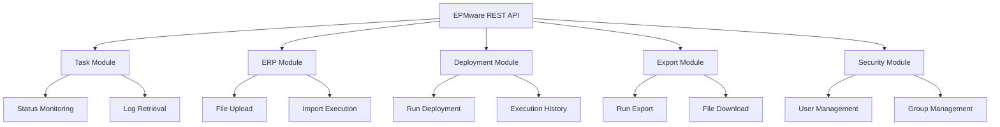
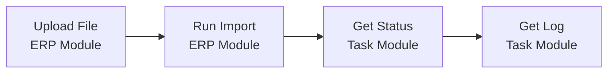
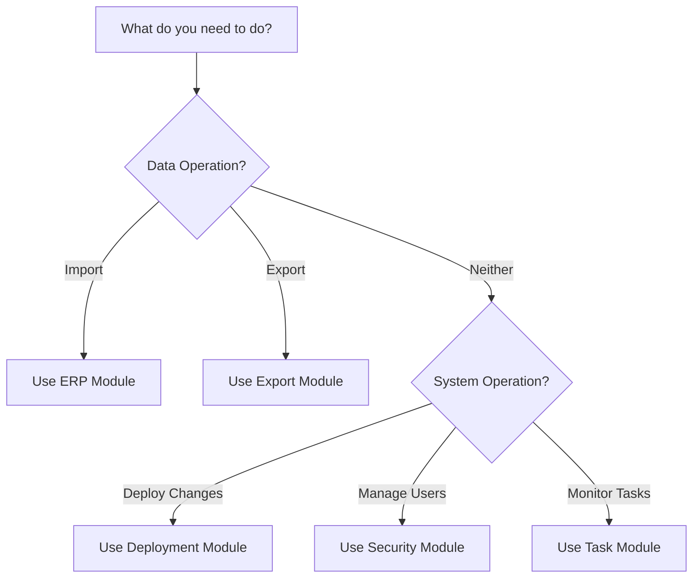

# API Modules

The EPMware REST API is organized into functional modules, each providing specific capabilities for different aspects of the system.

## Available Modules

<div class="module-grid">

### 📋 [Task Module](task/)
Monitor and manage system tasks

**Key Features:**
- Get task status and progress
- Retrieve task log files
- Monitor long-running operations

**Common Use Cases:**
- Building monitoring dashboards
- Tracking automation workflows
- Debugging task failures

---

### 🏢 [ERP Module](erp/)
Enterprise Resource Planning integrations

**Key Features:**
- Upload data files
- Execute import processes
- Validate data mappings

**Common Use Cases:**
- Automated financial data imports
- Scheduled master data updates
- Integration with ERP systems

---

### 🚀 [Deployment Module](deployment/)
Deployment automation and management

**Key Features:**
- Execute deployments
- Track deployment progress
- Retrieve execution history

**Common Use Cases:**
- CI/CD pipeline integration
- Scheduled deployments
- Multi-environment management

---

### 📤 [Export Module](export/)
Data export and extraction operations

**Key Features:**
- Run export profiles
- Download generated files
- Schedule recurring exports

**Common Use Cases:**
- Data warehouse integration
- Report generation
- Backup automation

---

### 🔐 [Security Module](security/)
User and access management

**Key Features:**
- User creation and management
- Group assignment
- Permission control

**Common Use Cases:**
- User provisioning
- Access control automation
- Security audit reporting

</div>

## Module Architecture



## Module Comparison

| Module | Primary Purpose | Operation Type | Authentication | Rate Limit |
|--------|----------------|----------------|----------------|------------|
| **Task** | Monitoring | Read-only | Required | 100/min |
| **ERP** | Data Import | Read/Write | Required | 50/min |
| **Deployment** | System Changes | Write | Required | 10/min |
| **Export** | Data Extraction | Read | Required | 50/min |
| **Security** | Access Control | Read/Write | Required | 50/min |

## Common Patterns Across Modules

### Asynchronous Operations

Most modules support asynchronous operations for long-running tasks:

```json
// 1. Initiate operation
POST /service/api/{module}/run
Response: { "taskId": "244591" }

// 2. Monitor status
GET /service/api/task/get_status/244591
Response: { "status": "RUNNING", "percentComplete": 45 }

// 3. Retrieve results
GET /service/api/{module}/download_file/244591
```

### Standard Response Format

All modules use consistent response formats:

**Success Response:**
```json
{
  "status": "S",
  "message": "Operation successful",
  "data": { ... }
}
```

**Error Response:**
```json
{
  "status": "E",
  "message": "Error description",
  "errorCode": "ERR_001"
}
```

### Common Parameters

Parameters used across multiple modules:

| Parameter | Type | Description | Example |
|-----------|------|-------------|---------|
| `name` | String | Resource name | `"Q1_Report"` |
| `format` | String | Output format | `"JSON"`, `"CSV"` |
| `async` | Boolean | Asynchronous execution | `true` |
| `notify` | Boolean | Email notification | `false` |

## Module Dependencies

Some operations require coordination between modules:



## Security Considerations

### Module-Level Permissions

Each module requires specific permissions:

- **Task Module**: `VIEW_TASKS`
- **ERP Module**: `MANAGE_IMPORTS`
- **Deployment Module**: `EXECUTE_DEPLOYMENTS`
- **Export Module**: `RUN_EXPORTS`
- **Security Module**: `MANAGE_USERS`

### Cross-Module Operations

When operations span multiple modules, ensure the user has permissions for all involved modules.

## Performance Guidelines

### Recommended Practices by Module

| Module | Best Practice | Rationale |
|--------|---------------|-----------|
| **Task** | Poll status every 5-10 seconds | Avoid overwhelming the server |
| **ERP** | Batch uploads when possible | Reduce API calls |
| **Deployment** | Schedule during off-hours | Minimize system impact |
| **Export** | Use compression for large files | Reduce bandwidth |
| **Security** | Cache user/group data | Minimize repeated queries |

## Module Selection Guide

Choose the right module for your use case:



## Integration Examples

### Multi-Module Workflow

Example: Complete data processing pipeline

```python
# 1. Upload data file (ERP Module)
upload_response = upload_file("data.csv")
upload_task_id = upload_response["taskId"]

# 2. Monitor upload (Task Module)
wait_for_completion(upload_task_id)

# 3. Run import (ERP Module)
import_response = run_import("DataImport")
import_task_id = import_response["taskId"]

# 4. Monitor import (Task Module)
wait_for_completion(import_task_id)

# 5. Export results (Export Module)
export_response = run_export("ResultsExport")
export_task_id = export_response["taskId"]

# 6. Download results (Export Module)
download_file(export_task_id)
```

## Next Steps

Ready to explore specific modules?

<div class="module-links">

📋 **[Task Module Documentation](task/)** - Learn about task monitoring

🏢 **[ERP Module Documentation](erp/)** - Master data import operations

🚀 **[Deployment Module Documentation](deployment/)** - Automate deployments

📤 **[Export Module Documentation](export/)** - Configure data exports

🔐 **[Security Module Documentation](security/)** - Manage users and permissions

</div>

## Need Help?

- 📖 Review [API Reference](../reference/) for detailed endpoint documentation
- 💡 Check [Examples](../examples/) for practical implementations
- ❓ See [Troubleshooting Guide](../appendices/troubleshooting/) for common issues

---

[← Back to Getting Started](../getting-started/) | [API Reference →](../reference/)
